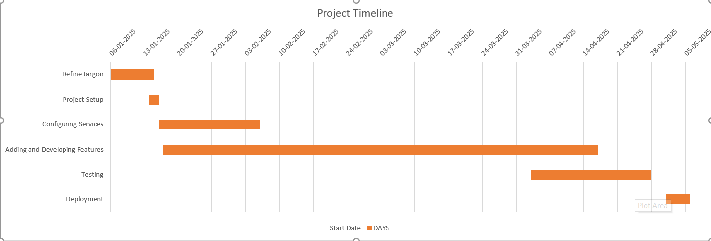

# College Compass

A comprehensive mobile application designed to streamline academic and campus management tasks for college students. College Compass serves as a one-stop solution for managing emails, attendance, hostel arrangements, and collaborative study materials.

## Features

### 🔤 Email Sorter
- Intelligent email categorization using machine learning
- Automated prioritization of academic and administrative emails
- Seamless integration with institutional Gmail accounts

### 📅 Attendance Tracker
- Real-time attendance monitoring
- Customizable attendance goals
- Automated notifications for low attendance

### 🏠 Hostel Leave Management
- Automated leave request email generation
- Status tracking for submitted requests
- Template-based email composition

### 📚 Past Year Question (PYQ) Database
- Comprehensive collection of previous year exam questions
- Searchable database with filtering options
- Regular updates with new question papers

### 📝 Collaborative Notes
- Real-time collaborative note-taking
- Support for rich text formatting
- Automatic syncing across devices

### 🔐 OAuth Authentication
- Secure user authentication
- Integration with institutional login systems
- Role-based access control

## Technology Stack

### Frontend Framework
- **React Native with Expo**: A powerful framework for building cross-platform mobile applications. Expo provides a managed workflow that simplifies development by providing pre-built native components and development tools.

### Database and ORM
- **Expo SQLite**: A built-in SQLite implementation for Expo apps that provides a lightweight, serverless database solution perfect for local data storage.
- **Drizzle ORM**: A TypeScript ORM that provides type-safe database queries and schema management, making it easier to work with SQLite in a type-safe manner.

### State Management and Data Fetching
- **TanStack Query**: Powerful asynchronous state management for fetching, caching, and updating data in React applications. It provides features like automatic background refetching, cache management, and optimistic updates.

### Backend Services
- **Firebase**: A comprehensive backend-as-a-service platform that provides authentication, hosting, and real-time database capabilities.

### Real-time Features
- **WebSocket APIs**: Enables real-time bi-directional communication between the client and server.
- **Y.js**: A CRDT framework that enables real-time collaboration features in the app, particularly useful for the collaborative notes feature.

### APIs and Integration
- **Gmail API**: Enables integration with institutional email systems, allowing the app to manage and organize student emails.

This technology stack was chosen to provide:
- Robust local data persistence with SQLite and Drizzle
- Efficient state management and data synchronization with TanStack Query
- Real-time collaboration capabilities with Y.js
- Secure authentication and backend services with Firebase
- Cross-platform compatibility and easy deployment with Expo

### Project Timeline
